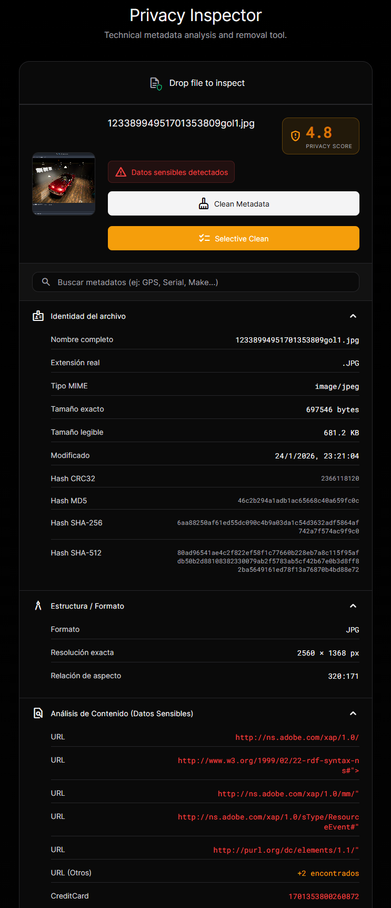

# Online EXIF Data Viewer 📷

Un visor de metadatos EXIF moderno, seguro y 100% local. Diseñado con un estilo "glassmorphism" inspirado...

## ✨ Características

Este visor es 100 % local y ofrece un conjunto muy completo de herramientas para inspeccionar y sanitizar metadatos. Todas las acciones se ejecutan en el navegador, **nunca se sube nada**.

- **Carga flexible**: botón, arrastrar‑soltar, pegar (Ctrl+V) o arrastrar desde otra ventana.
- **Vista previa segura**: imágenes mostradas usando Blob URLs, sin exponer rutas reales.
- **Extracción exhaustiva**: lee EXIF, GPS, MakerNotes, IPTC, XMP, ICC, PDF y DOCX.
- **Búsqueda en metadatos** con resaltado de coincidencias.
- **Limpieza selectiva o completa** mediante checkboxes; elimina sólo lo que elija el usuario.
- **Panel de diffs visuales** que muestra qué campos han sido borrados.
- **Sistema de undo/redo** para retroceder o rehacer limpiezas en cualquier momento.
- **Hashing de integridad**: SHA‑512, SHA‑256, MD5 y CRC32 tanto antes como después.
- **Scoring de privacidad** con detección avanzada (URLs, IMEI, SSN, tarjetas, direcciones cripto, etc.) y penalizaciones ponderadas.
- **Soporte de documentos**: extrae metadatos de PDF y DOCX automáticamente.
- **Compatibilidad móvil** y diseño responsivo con animaciones ligeras.
- **Offline y sin servidor**: todo el código corre en el cliente; se puede servir desde GitHub Pages.

## 🛠️ Tecnologías

- HTML5, CSS3 (Variables, Flex/Grid, Backdrop-filter)
- Vanilla JavaScript moderno (ES6+) y ES modules
- [ExifReader](https://github.com/mattiasw/ExifReader) + `piexif.js` para manipular
- `pdf.js` para metadatos PDF y `JSZip` para DOCX
- `crypto-js` para MD5 y Web Crypto API para SHA/CRC32
- Sin dependencias de servidor; desplegable en GitHub Pages u otro CDN estático.

## 📷 Capturas de ejemplo

Antes de limpiar:

Después de limpieza (metadatos borrados):

## 🔒 Seguridad

El diseño prioriza la privacidad y seguridad:

- **Procesado local al 100 %**: no existe backend ni envío de datos.
- **Sanitización exhaustiva** de todos los valores antes de renderizar.
- **Hashes de integridad** permiten comprobar que el archivo no ha sido manipulado.
- **Modelo de permisos cero**: excepto el acceso al archivo seleccionado, la app no pide nada más.

## 🆕 Novedades

Las últimas actualizaciones han convertido a la aplicación en una *herramienta profesional* de análisis de privacidad, y se han aplicado mejoras profundas en el motor de detección para reducir falsos positivos y aumentar la fiabilidad:

- 🔍 **Búsqueda multifuncional** en todo el árbol de metadatos con resaltado.
- ✅ **Selección checkbox** para eliminar campos individuales y ver resultados con diffs visuales.
- 🔄 **Deshacer/Rehacer** cambios a cualquier paso gracias al historial de estados.
- 🔐 **Hashes múltiples** (SHA‑512, SHA‑256, MD5, CRC32) para verificar integridad de archivos.
- 📄 **Soporte agregado para PDF y DOCX** con extracción de metadatos y análisis de sensibilidad.
- 🧠 **Detección avanzada** de datos sensibles (IMEI, SSN, tarjetas, coordenadas, direcciones cripto...) con puntaje de privacidad optimizado.
- 📉 Estadísticas de ahorro de tamaño tras limpieza y comparadores antes/después.
- 🎨 Mejoras generales de UI/UX, incluyendo panel de diffs y carga mejorada.

### Cambios principales en el motor de análisis

- **Patrones y validadores** – la constante `REGEX_PATTERNS` ahora contiene expresiones más estrictas y, sobre todo, junto a cada regex hay una función de validación secundaria (por ejemplo, para teléfonos compruebo longitudes y prefijos válidos, para IMEI el checksum Luhn, etc.). Esto reduce matches sobre números aleatorios como los que salen en capturas de depuración.

- **Clasificación de contenido** – se añadió `isTextLikeFile()` y en `handleFile()` se divide el flujo: si el fichero no es texto no se aplican regex indiscriminados, se extraen sólo metadatos y se analizan allí. De ese modo un `.jpg` con un valor numérico en EXIF ya no se interpreta como “phone”.

- **Prioridad y deduplicación** – antes cada coincidencia se añadía a la lista y se puntuaba. Ahora se agrupan por tipo y valor único, y existe una jerarquía (IMEI gana sobre Phone, por ejemplo), de modo que no aparecen tres “teléfonos” por el mismo número ni se penaliza doblemente.

- **Recalculo de score** – el riesgo final se basa en hallazgos fiables y únicos; no sube por repeticiones técnicas. La lógica de scoring está ubicada al final de `app.js`, también refactorizada.

- **Análisis en metadatos** – en lugar de perder detecciones reales, la app sigue buscando PII en EXIF/XMP/ICCs cuando corresponde, pero con las reglas nuevas.

El cambio objetivo fue convertir la simple lectura de EXIF en un **análisis completo de privacidad y limpieza**, ahora con menos ruido y más acierto.